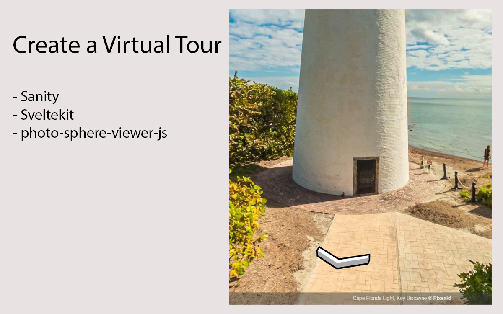

# A minimal SvelteKit Virtual Tour site with Sanity Studio

This starter uses [SvelteKit 2](https://kit.svelte.dev/) for the frontend and [Sanity](https://sanity.io/) to handle its content.

## Demo Page

- [Demo Page](https://enchanting-parfait-a5b9f6.netlify.app/)

## Featuring

- How to fetch content as data from [the Sanity Content Lake](https://www.sanity.io/docs/datastore)
- A [Sanity Studio](https://www.sanity.io/docs/sanity-studio) to create and edit content
- A virtual tour using [Photo Sphere Viewer Virtual Tour](https://photo-sphere-viewer.js.org/plugins/virtual-tour.html) official Plugin

> **Note**
>
> This starter features an `/app` and a `/studio` folder. The `/app` folder contains the frontend code, and the `/studio` folder contains the Sanity Studio code.
>
> This is **not** a monorepo setup. We put them both in one repository for the sake of simplicity. You might want to have separate repositories for each of the folders, to make it easier to deploy the app and the studio separately.

## Prerequisities

- [Node.js](https://nodejs.org/en/) (v14.18 or later)
- [Sanity CLI](https://www.sanity.io/docs/getting-started-with-sanity-cli) (optional)

## Getting started

The following commands are meant to be run in **both** the `/app` and `/studio` folders.

1. `npm install` to install dependencies
2. `npx -y sanity@latest init --env`, this will:

- ask you to select or create a Sanity project and dataset, use the same Sanity project and dataset in both folders.
- output a `.env` file with appropriate variables
- _(or use `sanity init --env` if you have the CLI installed)_

4. Prefix your environment variables in the SvelteKit `/app` folder with `PUBLIC_`, they should be `PUBLIC_SANITY_DATASET` and `PUBLIC_SANITY_PROJECT_ID`.
3. `npm run dev` to start the development server

Your SvelteKit app should now be running on [http://localhost:5173/](http://localhost:5173/) and Studio on [http://localhost:3333/](http://localhost:3333/).

_Feel free to move each of the folders to their own location and check them into version control._

### Add content

1. Visit the Studio and create and publish a new `VirtualTourPageBlocks` and `VirtualTourItem` document
2. Visit the App and refresh the page to see your content rendered on the page

The schema for the `VirtualTourPageBlocks` and `VirtualTourItem` document are defined in the `/studio/schemas` folder. You can add more documents and schemas to the Studio to suit your needs.

## Additional Configurations to the Virtual Tour

The Virtual Tour is controlled by the file `app/src/lib/Virtual.svelte` which uses the `Manual` mode using `textureX/textureY` coordinate system. This can be changed to `yaw/pitch` or GPS mode using the guide on the [Official Plugin Website](https://photo-sphere-viewer.js.org/plugins/virtual-tour.html#usage)

The nodes are configured in `Client Mode`. The Virtual Tour by itself in the `new Viewer({ ... })` can be configured with more options using [Standard Configurations](https://photo-sphere-viewer.js.org/guide/config.html#standard-options) and [Advanced Configuration](https://photo-sphere-viewer.js.org/guide/config.html#advanced-options) Options. This will be helpful in customizing the viewer's page.

## Removing TypeScript

If you do not wish to use TypeScript, we've included a `remove-typescript.mjs` file in the root of this repository.

To run this file, you must:

1. Run `npm install` in the repository root to install dependencies
2. Run `node remove-typescript.mjs` to strip all types from both the `/app` and `/studio` folders

If you intend to use TypeScript or have stripped TypeScript, you can safely delete all files in the repository root that isn't `/studio` or `/app`.

## Deployments

The `/app` and `/studio` folders are meant to be deployed separately.

Feel free to deploy the App to whichever hosting provider you prefer.

You can deploy the Sanity Studio by running `sanity deploy` in the `/studio` repository, provided you have the `@sanity/cli` installed globally.
